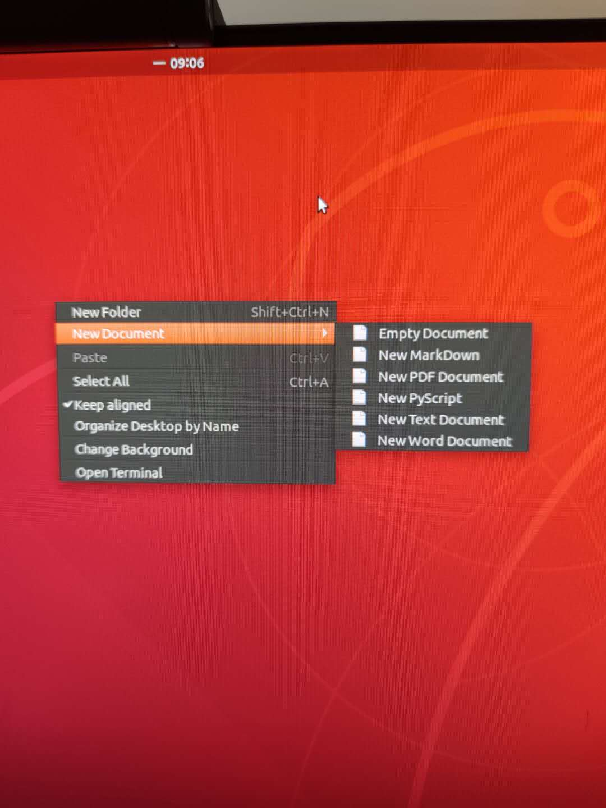

**问题**： Ubuntu 18.04 LTS 桌面无法通过右键新建文件
**原因**：新建文档”按钮不再被集成在 Ubuntu GNOME 版本中
**解决方案：**
进入文件夹：
*cd ~/Templates*
如果没有对应文件夹，请进行创建，并进入： 
*mkdir ~/Templates & cd ~/Templates*
创建新文件即可：
*touch Empty\ Document*
此时，在Nautilus 文件管理器，右键单击菜单中即可成功添加“新建文档”按钮。
其他类型文档：
*touch  New\ MarkDown.md*
*touch New\ Text\ Document.txt*
*touch New\ Word\ Document.docx*

