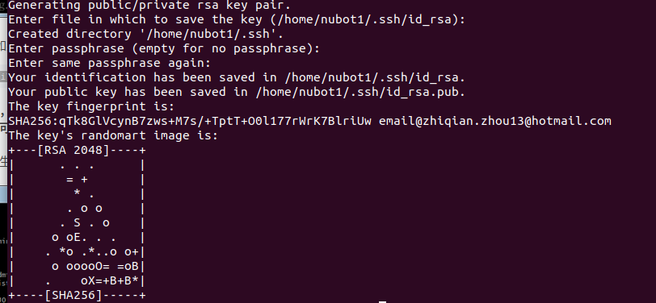

一、用户配置

```
git config --global user.name "name"//你的用户名
git config --global user.email email@email.com//你的邮箱
```

二、生成ssh公钥

公钥文件存储位置为~/.ssh,可以通过查看对应文件位置

ssh公钥生成命令为：

```
ssh-keygen -t rsa -C email@email.com
```

email. com需要用你的邮箱进行代替，得到结果如下图所示：



可以通过以下命令查看公钥：

```
gedit ~/.ssh/id_rsa.pub
```

不再输入github帐号名字与密码，在下次密码输入后生效：

```
git config --global credential.helper store
```