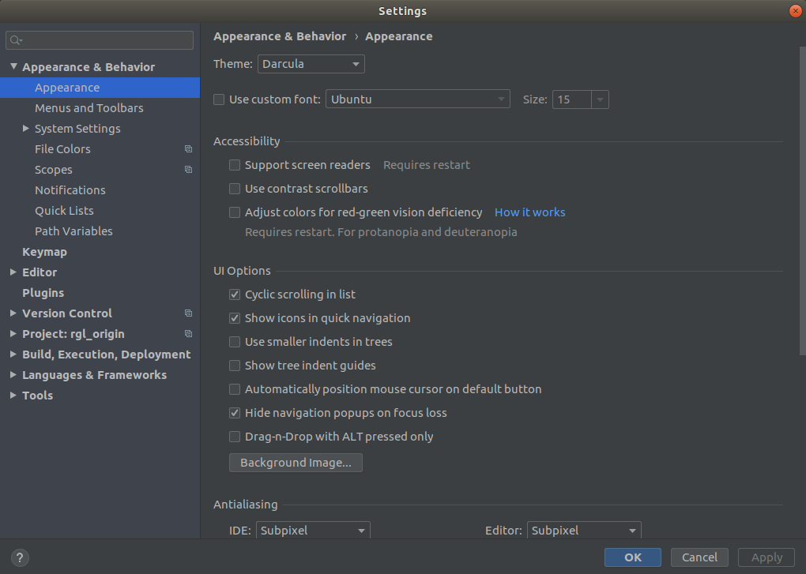

**准备工作**：两个文件，pycharm-professional-2020.1.tar.gz 与 jetbrains-agent-latest.zip，前者为pycharm软件，后者为破解工具，pycharm版本为2020.1

**操作步骤**：

1. 两个文件进行解压，得到两个文件夹

2. 进入pycharm的bin文件夹（假设当前位置为两个解压文件所在位置）

   cd pycharm-professional-2020.1/pycharm-2020.1/bin

3. 启动pycharm脚本

   sh ./pycharm.sh

4. 此时，系统需要注册激活，选择试用30天的选项，进入ide（就是指pycharm）
5. 将 jetbrains-agent.jar 拖进IDE窗口(或者当作IDE插件安装),点 Restart 按钮重启IDE。
6. 在弹出的JetbrainsAgent Helper对话框中,选择 激活方式 ,点击 安装按钮 。
7. 重启IDE,搞定。

**pycharm更换背景：**

启动ide，单击file，选择setting，得到如下界面：



选择appearance，进行选择

右边的theme即为主题，默认包含黑色主题Darcula，白色主题Intellij Light ，以及黑白对比更为突兀的High Contrast

也可以在Background Image选项中，选择自己喜欢的图片，作为背景。

**生成桌面快捷启动方式：**
```
sudo gedit /usr/share/applications/pycharm.desktop
```
将文件修改为：
```
[Desktop Entry]
Type=Application
Name=Pycharm
GenericName=Pycharm3
Comment=Pycharm3:The Python IDE
Exec=sh /home/fetch/workspace/zhiqian/software/pycharm-professional-2020.1/pycharm-2020.1/bin/pycharm.sh   
Icon=/home/fetch/workspace/zhiqian/software/pycharm-professional-2020.1/pycharm-2020.1/bin/pycharm.png
Terminal=pycharm
Categories=Pycharm;
```
其中exec与icon分别对应pycharm启动脚本以及pycharm图标的位置，在pycharm-professional-2020.1解压文件对应位置

**将pycharm启动图标添加到启动器（launcher）：**
其实就是赋予pycharm.desktop可执行权限即可，对应命令如下：
```
cd /usr/share/applications/
sudo chmod u+x pycharm.desktop 
```
通过ls可以看出，pycharm.desktop已经由灰白色变为了绿色（可执行文件的颜色）
进而启动pycharm右键添加到favorites即可完成。

