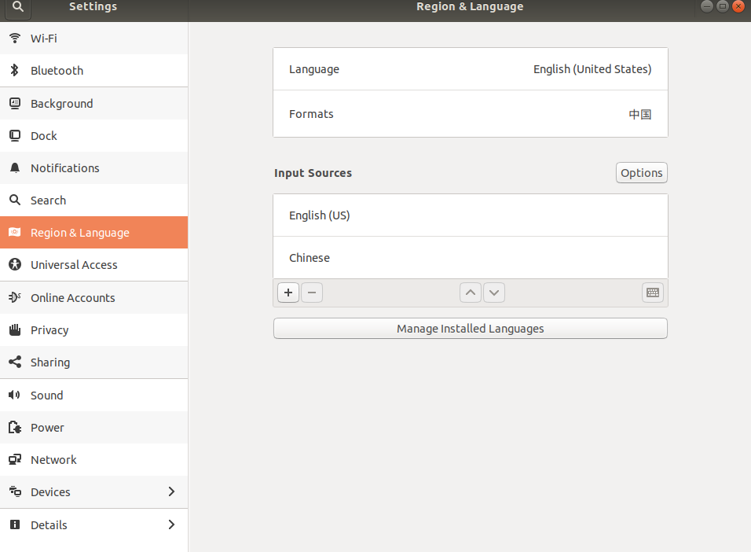
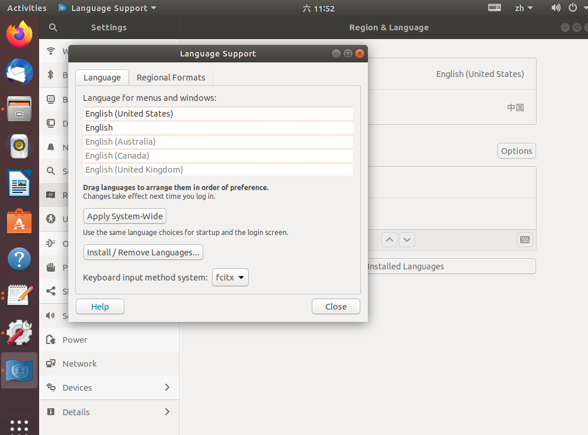
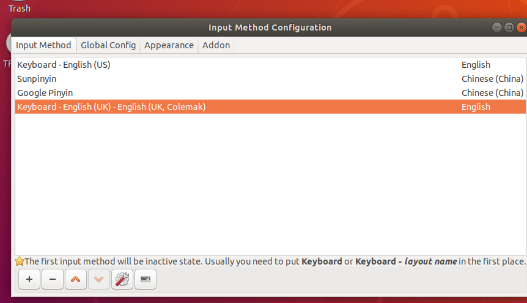
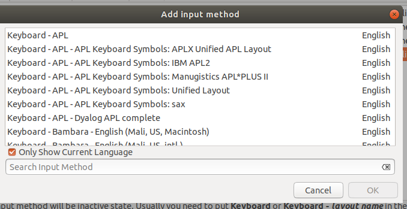

问题：ubuntu 18.04中缺少中文输入法

解决方案：

首先，由于大部分软件，譬如pycharm，qtcreator，福昕阅读器等，不支持ibus框架，因此，需要先下载fcitx语言框架，

*sudo apt install fcitx*

在设置中配置“区域与语言”（region & language），将ibus改为fcitx，重启电脑

1.1 单击桌面右上角的倒三角符号，而后点击齿轮符号（绝大多数界面中，它代表的都是设置setting），进入系统设置setting

1.2 得到的界面如下图所示，选择Region & Language，单击Manage Installed Languages，

1.3 将输入方法框架由ibus改为fcitx，结果如下

2.0 下载fcitx框架下的输入方法，我选择的是sunpinyin和googlepinyin，没有选择sogou的原因是sogoupinyin与gnome框架存在某些冲突，可能会出现问题，所以就直接放弃了。

*sudo apt install fcitx-sunpinyin fcitx-googlepinyin*

2.1 进而配置输入方法，添加sunpinyin和googlepinyin即可

首先，单击图1中的键盘符号，选择configure或者configure current input method，得到如下界面

而后，单击左下角 + 符号，选择下载得到的输入法即可，需要注意的是，选择pinyin是需要将下图的only show current language取消，方可找到sunpinyin与googlepinyin，因为我当前的系统默认语言为英语。 

3.0  部分软件无法输入中文问题